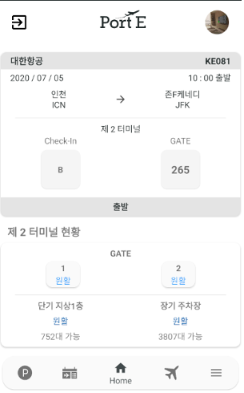

# PortE

  
인천공항의 내부 안내, 항공권 검색, 나의 항공권 정보에 따른 탑승구 안내 및 대기자 현황을 제공하는 협업 프로젝트

## 활용기술
- Kotlin
- MVVM 패턴
- 공공 API활용
- Retrofit2
- Firebase

## 기능
초기 실행화면  

프로필 생성  

메인화면  
(좌) 항공권 등록 전 / (우) 항공권 등록 후  

항공권 검색  및 수정  

주차장 및 출국장 현황  

이벤트 안내  

